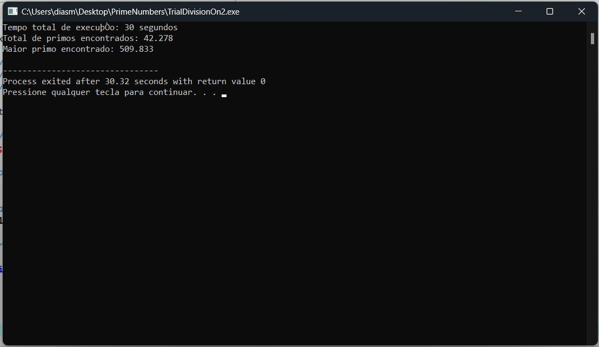
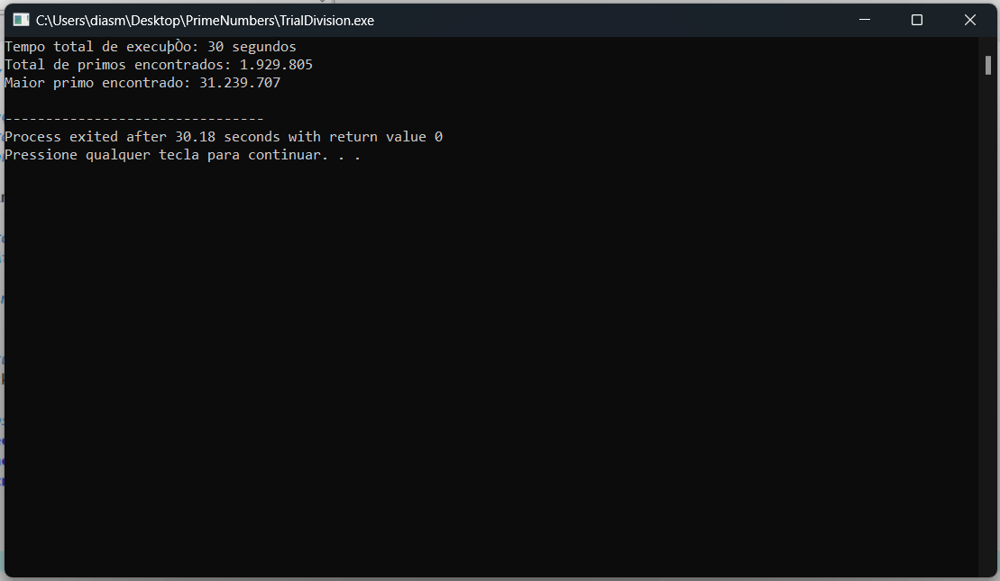
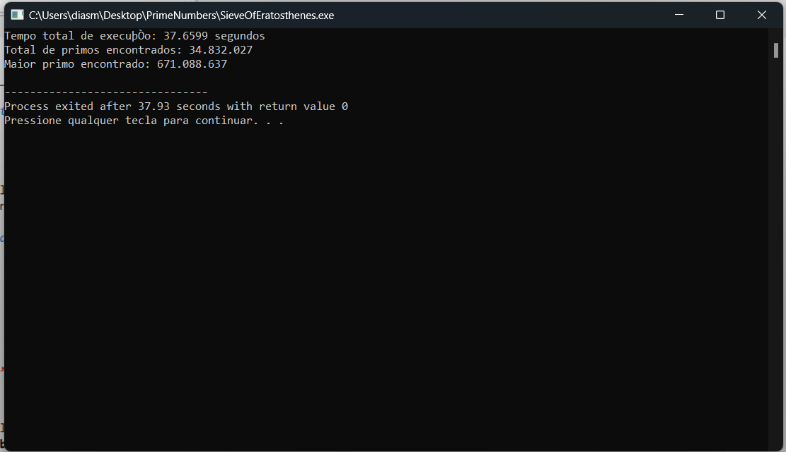

# Estudo de Algoritmos para Encontrar Números Primos em C++

Este repositório contém três implementações distintas para encontrar números primos dentro de um intervalo de tempo determinado (30 segundos). O objetivo é comparar diferentes abordagens e analisar seu desempenho.

## Algoritmos Implementados

### 1. **Força Bruta**
- Testa a divisibilidade de cada número até ele mesmo (menos 1).
- Complexidade: O(n²)
- Ineficiente para grandes números, pois verifica todos os divisores possíveis.

### 2. **Otimização com Raiz Quadrada**
- Testa divisibilidade apenas até \(\sqrt{n}\), reduzindo a complexidade.
- Descarta números pares maiores que 2.
- Complexidade: O(n√n)
- Muito mais eficiente que a abordagem de força bruta.

### 3. **Crivo de Eratóstenes Segmentado**
- Implementa o **Crivo de Eratóstenes** para marcar múltiplos de primos.
- Utiliza um vetor de booleanos para evitar recomputação desnecessária.
- Complexidade: O(n log log n)
- Extremamente eficiente para grandes intervalos de números.

## Estrutura dos Códigos

Todos os códigos compartilham algumas funcionalidades:
- **`format_number(int n)`** → Formata os números grandes com separadores de milhar para melhor visualização.
- **Medição de tempo** → Cada algoritmo é executado por 30 segundos e registra o tempo total de execução.
- **Contadores de primos** → Exibe o total de números primos encontrados e o maior primo identificado.

## Comparação de Desempenho

Os testes foram realizados utilizando uma máquina com [especificar CPU e RAM, se possível]. Os resultados são apresentados abaixo:

| Algoritmo | Total de Primos Encontrados | Maior Primo | Tempo de Execução |
|-----------|----------------------------|-------------|--------------------|
| Força Bruta | [42.278] | [509.833] | 30s |
| Otimização com √n | [1.929.805] | [31.239.707] | 30s |
| Crivo de Eratóstenes | [34.832.027] | [671088637] | 37s |

**Observações:**
- O método de força bruta apresentou o pior desempenho, com menor quantidade de primos encontrados.
- A otimização com raiz quadrada melhorou significativamente a performance.
- O Crivo de Eratóstenes foi o mais eficiente, encontrando o maior número de primos no tempo estipulado.

## Como Executar os Códigos

1. Compile o código com g++:
   ```sh
   g++ algoritmo.cpp -o algoritmo
   ```
2. Execute o programa:
   ```sh
   ./algoritmo
   ```
3. Observe os resultados no terminal.

## Imagens de Execução

#### **Execução do Algoritmo de Força Bruta**


#### **Execução da Divisão por Tentativa Otimizada**


#### **Execução do Crivo de Eratóstenes**


## Conclusão

Este estudo demonstrou a importância de algoritmos eficientes para encontrar números primos. Para aplicações reais que lidam com grandes números, o **Crivo de Eratóstenes** se mostrou a melhor opção.

---

**Autor:** [Murilo D.]
